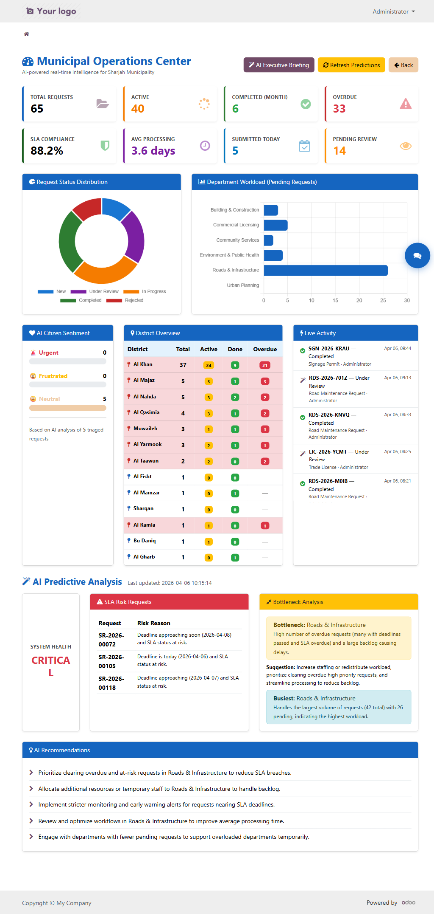
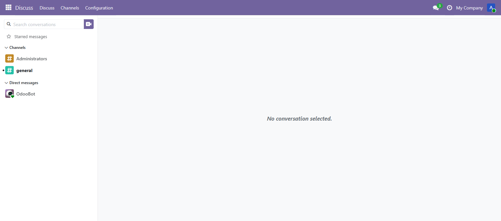
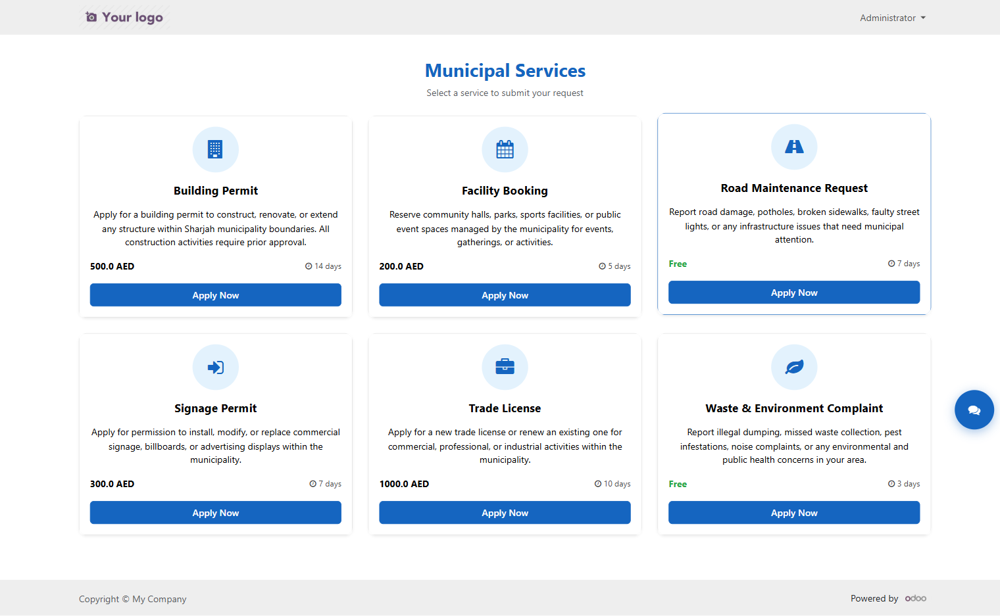
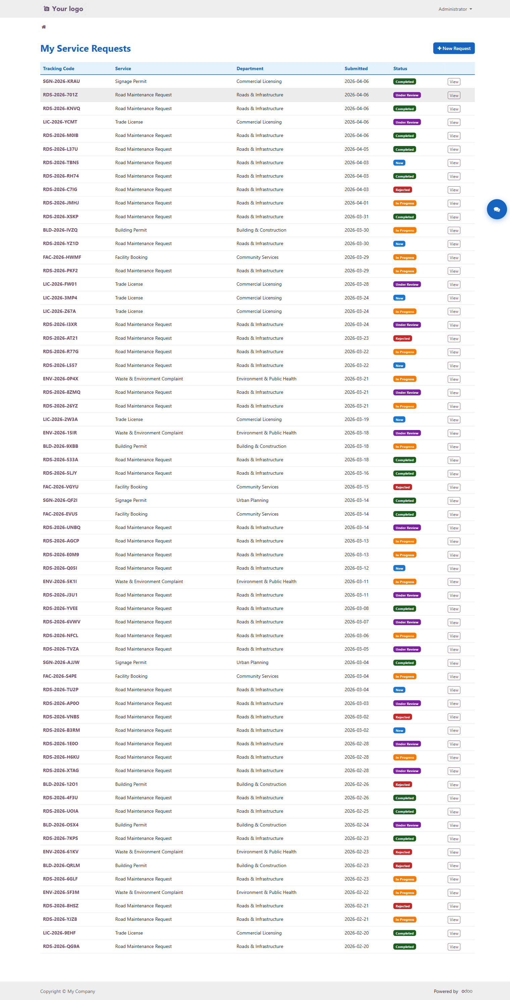
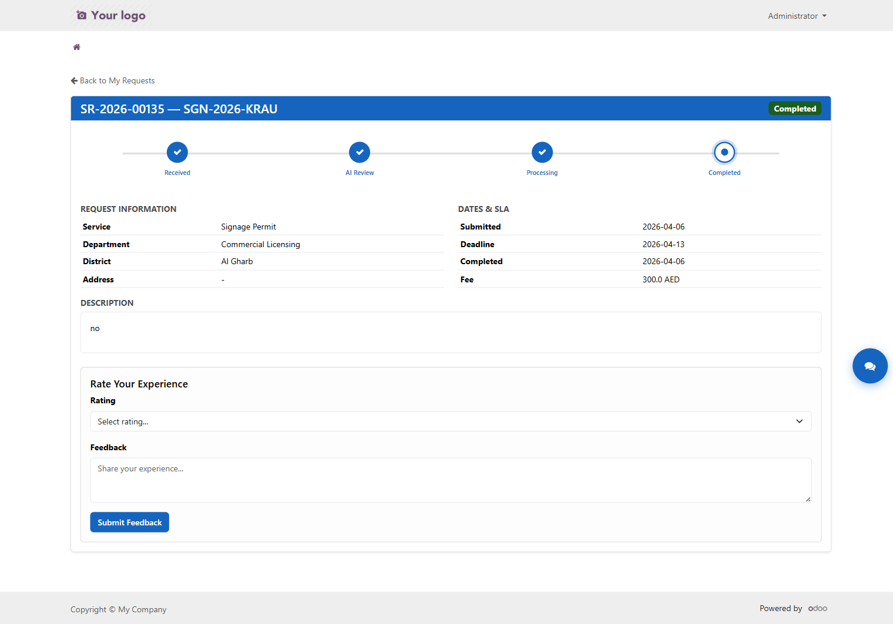

<div align="center">


# Baladiya — AI-Powered Smart Municipality Platform

**An intelligent public services management system built on Odoo 19**

[](https://www.odoo.com)
[](https://python.org)
[](https://postgresql.org)
[](https://openai.com)
[](LICENSE)

> *"We built an AI that runs a city. Humans just approve."*

[Live Demo](#demo) · [Features](#features) · [Installation](#installation) · [Architecture](#architecture)

</div>

---

## Overview

**Baladiya** (Arabic: بلدية, meaning *Municipality*) is a production-ready smart government platform that replaces paper-based municipal services with an AI-driven digital system. Built for **Sharjah, UAE**, it connects citizens, government officers, and AI in a single unified workflow.

Citizens submit requests through a modern self-service portal. Every request is automatically triaged by AI, routed to the right department, tracked against SLA deadlines, and surfaced in a real-time operations intelligence dashboard — all without human data entry.

---

## Screenshots

### Municipal Operations Center — AI Dashboard

> Real-time KPIs, Chart.js visualizations, district heatmap, live activity feed, and AI predictive analysis.



---

### Backend Kanban — Staff Workflow Board

> Requests move through New → Under Review → In Progress → Completed columns with SLA status badges and AI-generated insights on every card.



---

### Citizen Portal — Service Catalog

> Self-service portal where citizens browse and apply for municipal services including building permits, trade licenses, road maintenance, and more.



---

### My Requests — Request Tracking

> Citizens track all their requests with colored status badges, submission dates, and a direct link to full request details.



---

### Request Detail — Progress Stepper

> 4-stage visual progress tracker (Received → AI Review → Processing → Completed) with SLA dates, fee display, and citizen feedback collection.



---

## Features

### For Citizens
- **Self-Service Portal** — Browse service categories and submit requests online with file attachments
- **Real-Time Tracking** — Public tracking page via unique tracking code (no login required)
- **QR Code Confirmation** — Every submitted request generates a QR code for instant mobile tracking
- **WhatsApp Sharing** — One-click WhatsApp share button sends the tracking link to family/contacts
- **Request History** — Full list of past and active requests with status badges
- **Feedback & Ratings** — Post-completion satisfaction ratings directly in the portal

### For Government Officers
- **Kanban Workflow Board** — Drag-and-drop Kanban with SLA health bars per column
- **AI-Powered Triage** — Every request is automatically analyzed for priority, risk, and routing
- **Bulk AI Triage** — One-click "AI Triage All Pending" action processes dozens of requests at once
- **SLA Tracking** — Automatic deadline calculation with overdue alerts and compliance reporting
- **Document Validation** — AI checks attachment relevance and flags missing documentation
- **AI Chatbot** — Floating assistant answers questions about any request using live database context

### AI Intelligence (7 Specialized Brains)
| Brain | Function |
|-------|----------|
| **Brain 1 — Triage** | Classifies priority, extracts key details, assesses risk |
| **Brain 2 — Document Validator** | Checks uploaded files are relevant to the request type |
| **Brain 3 — Response Drafter** | Writes professional citizen-facing update messages |
| **Brain 4 — Insight Generator** | Adds similar-case context and processing predictions |
| **Brain 5 — Chatbot** | Answers natural language questions using live request data |
| **Brain 6 — Predictive Analytics** | Forecasts SLA risks, bottlenecks, and system health |
| **Brain 7 — Executive Briefing** | Generates a plain-English operations intelligence report on demand |

### Operations Intelligence Dashboard
- **Animated KPI Cards** — 8 real-time metrics with counter animations
- **Doughnut Chart** — Request distribution by state (Chart.js)
- **Horizontal Bar Chart** — Department workload comparison (Chart.js)
- **AI Citizen Sentiment Panel** — Frustrated / Urgent / Neutral breakdown with progress bars
- **District Heatmap Table** — 14 Sharjah districts ranked by volume, overdue count, and completion rate
- **Live Activity Feed** — Real-time stream of the 15 most recent request updates
- **AI Executive Briefing** — Click one button → GPT-4o reads all live data → generates a 3-paragraph intelligence report with typewriter animation

---

## Tech Stack

| Layer | Technology |
|-------|------------|
| **Backend Framework** | Odoo 19.0 (Python 3.10+) |
| **Database** | PostgreSQL 13+ |
| **ORM** | Odoo Custom ORM (recordsets, computed fields, constraints) |
| **Frontend** | QWeb templates, Bootstrap 5, Chart.js 4.4, QRCode.js |
| **AI / LLM** | OpenAI GPT-4o-mini (direct HTTP via `urllib`) |
| **Portal** | Odoo Website portal (extends `CustomerPortal`) |
| **Background Jobs** | Odoo `ir.cron` scheduled actions |
| **Auth** | Odoo session-based auth + public routes for tracking |

---

## Architecture

```
┌──────────────────────────────────────────────────────────┐
│                    CITIZEN PORTAL                        │
│  /my/services  /my/requests  /track  /my/services/apply  │
└────────────────────────┬─────────────────────────────────┘
                         │ HTTP / QWeb
┌────────────────────────▼─────────────────────────────────┐
│                   ODOO 19 SERVER                          │
│                                                          │
│  Controllers         Models                              │
│  ├── portal.py       ├── baladiya.service.request        │
│  └── ai_chatbot.py   ├── baladiya.department             │
│                      ├── baladiya.service.category       │
│                      └── baladiya.ai.service  ◄──── AI   │
│                                                          │
│  Views                                                   │
│  ├── Kanban (backend)     ├── Portal templates           │
│  └── AI Dashboard (web)  └── Form / List views           │
└────────────────────────┬─────────────────────────────────┘
                         │ ORM / SQL
┌────────────────────────▼─────────────────────────────────┐
│                   PostgreSQL                              │
└──────────────────────────────────────────────────────────┘
                         │ HTTPS
┌────────────────────────▼─────────────────────────────────┐
│              OpenAI API (GPT-4o-mini)                    │
│   Triage · Validate · Draft · Predict · Brief            │
└──────────────────────────────────────────────────────────┘
```

### Module Structure

```
addons/baladiya/
├── models/
│   ├── baladiya_service_request.py   # Core model — workflow, SLA, AI triggers
│   ├── baladiya_department.py        # Department with pending_count computed field
│   ├── baladiya_service_category.py  # Service catalog with fee + SLA config
│   ├── baladiya_ai_service.py        # All 7 AI brains (OpenAI integration)
│   └── res_partner.py                # is_citizen extension
├── controllers/
│   ├── portal.py                     # Citizen portal routes
│   └── ai_chatbot.py                 # AI dashboard + chatbot + briefing routes
├── views/
│   ├── baladiya_service_request_views.xml  # Kanban, list, form
│   ├── baladiya_ai_dashboard_views.xml     # AI Operations Center (Chart.js)
│   ├── baladiya_portal_templates.xml       # All portal QWeb templates
│   └── baladiya_menus.xml                  # App menu structure
├── data/
│   ├── baladiya_departments_data.xml       # 6 Sharjah departments
│   ├── baladiya_service_categories.xml     # 6 service types with SLA
│   └── baladiya_cron_jobs.xml              # Scheduled AI analysis jobs
└── static/src/css/
    └── baladiya_portal.css                 # Portal + dashboard styles
```

---

## Installation

### Prerequisites

- Python 3.10 – 3.13
- PostgreSQL 13+
- Odoo 19.0 source
- OpenAI API key

### Setup

```bash
# 1. Clone into your Odoo addons path
git clone https://github.com/RohanRaoCs/baladiya-sample.git addons/baladiya

# 2. Install Python dependencies
pip install -r requirements.txt

# 3. Set your OpenAI API key
# In Odoo backend: Settings → Technical → System Parameters
# Key: baladiya.openai_api_key
# Value: sk-...

# 4. Initialize the module
python odoo-bin -c odoo.conf -d your_db -i baladiya --stop-after-init

# 5. Start the server
python odoo-bin -c odoo.conf
```

### Demo Credentials

| Role | Login | Password |
|------|-------|----------|
| Admin / Officer | `admin` | `admin` |
| Citizen | Register via `/web/signup` | — |

### Key URLs

| Page | URL |
|------|-----|
| Citizen Portal | `/my/services` |
| Public Tracking | `/track` |
| AI Operations Dashboard | `/baladiya/ai-dashboard` |
| Backend Kanban | `/odoo/action-baladiya.action_service_request` |

---

## Demo Flow (5 Minutes)

1. **Citizen submits a request** → `/my/services` → pick a category → fill form → receive QR code + WhatsApp share button
2. **AI auto-triages** → officer sees card appear in Kanban with AI priority badge, insights, and risk level
3. **Bulk triage** → select multiple requests → Action → *AI Triage All Pending* → watch all cards populate in seconds
4. **AI Dashboard** → visit `/baladiya/ai-dashboard` → animated KPIs, live charts, district heatmap
5. **Executive Briefing** → click *AI Executive Briefing* button → watch GPT-4o generate a live intelligence report with typewriter effect
6. **Public tracking** → `/track` → enter any tracking code → see real-time status without logging in

---

## Configuration

| System Parameter | Description | Default |
|-----------------|-------------|---------|
| `baladiya.openai_api_key` | OpenAI API key for all AI features | *(required)* |
| `baladiya.ai_dashboard_data` | Cached AI predictions JSON | `{}` |
| `baladiya.ai_dashboard_date` | Last prediction refresh timestamp | *(auto)* |

---

## Built For

**Odoo Public Services ERP Challenge** — Hackathon 2026

> Sharjah Municipality Digital Transformation Initiative

---

<div align="center">

Built with Odoo 19 · Powered by OpenAI · Made for Sharjah

</div>
